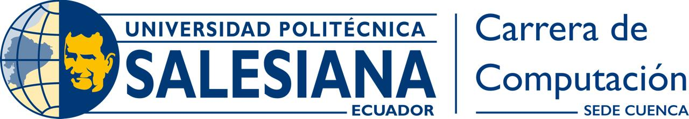

# Trabajo Final

**Integrantes:** Karina Garcia y Diego Rivera  
**Correos:** wgarciaf@est.ups.edu.ec , driverag2@est.ups.edu.ec
**Profesor:** Ing. Pablo Torres

# Descricpcion del problema 
Poder generar un tablero con las medidas proporcionadas por el usuario ademas de que en dicho tablero existan las mecanicas de celdas no transitables, celdas de inicio y fin, celdas visitadas y celdas de camino correcto, ademas de implementar distintos algoritmos para el recorrido de las celdas y encontrar las celdas de recorrido y celdas de camino correcto, tambien la implementacion de un delay para comodidad del usuario, una tabla que mide los tiempos y un alert que muestra las coordenadas exactas de las celdas que estan en el camino correcto
# Marco Teórico

## 1. Teoría de Grafos
La teoria de grafos tiene origen matematico, y no informatico, sirve para resolver varios problemas matematicos e informaticos gracias.
Un grafo es un conjunto de nodos que se relacionan entre si atraves de objetos conocidos como aristas, esta mecanica es usada para resolver problemas complejos en el area de matemticas discretas, ciencias sociales e informaticas

### 1.1. Nodos y Aristas

- **Nodos (Vértices)**: Son los puntos de un grafo que representan entidades o elementos del sistema.
- **Aristas (Bordes)**: Son las conexiones entre nodos que representan las relaciones o caminos posibles entre ellos.

### 1.2. Tipos de Grafos

- **Grafos Dirigidos**: Las aristas tienen una dirección, indicando un camino unidireccional.
- **Grafos No Dirigidos**: Las aristas no tienen dirección, indicando una conexión bidireccional.
- **Grafos Ponderados**: Las aristas tienen un peso o costo asociado, representando la "distancia" o el "costo" de la conexión.

## 2. Algoritmos de Búsqueda en Grafos

Hay dos principales algoritmos de busqeueda en los 
<!-- @import "[TOC]" {cmd="toc" depthFrom=1 depthTo=6 orderedList=false} -->
grafos que son BFS(Amplitud) y DFS(Profundidad), cada una usando distintas estructuras para poder recorrer el grafo de la manera deseada conociendo los nodos del grafo entendiendo que el nodo actual sera padre del siguiente nodo(Nodo vecino)

### 2.1. Búsqueda en Amplitud (BFS)

- **Descripción**: BFS explora los nodos nivel por nivel, comenzando desde el nodo de origen. Utiliza una cola(estructura fifo) para almacenar los nodos a explorar.
- **Aplicaciones**: Ideal para encontrar el camino más corto en grafos no ponderados y para problemas de niveles o capas en grafos.

### 2.2. Búsqueda en Profundidad (DFS)

- **Descripción**: DFS explora tan profundo como sea posible en una rama antes de retroceder y explorar otras ramas utiliza una pila (Respeta el orden de entrada y salida) para mantener el rastro de los nodos visitados.
- **Aplicaciones**: Útil para encontrar caminos en grafos dirigidos y no dirigidos, y para resolver problemas de conectividad y ciclos en grafos.

## 3. Algoritmos de Búsqueda Adicionales

Además de BFS y DFS hay otra manera para solucionar este problema y es usando la recursividad y la programacion dinamica 

### 3.1. Recursividad

- **Descripción**: Utiliza recursividad para recorrer los distintos caminos que hay en el grafo, va a repetirse este proceso hasta que se llegue al caso base de la funcion recursiva que en este caso es que la celda de inicio sea igual a la celda del final. A veces es mas eficaz pero otras veces puede tomar mas tiempo que BFS y DFS
### 3.2. Programación Dinámica con Caché

- **Descripción**: Utilizando programacion dinamica se encuentra un camino recorriendo todo el grafo, pero para encontrar dicho camino se recorren todos los nodos viendo si sale factible o no pasar por ellos en el camino final, haciendo esto se evita recorrer nodos que no sean necesarios o nodos ya visitados
### 4.2. Medición de Tiempo

- **Descripción**:Para evaluar el rendimiento de los algoritmos, se mide el tiempo de ejecución utilizando `performance.now()`. Esto se realiza para poder visualozar la diferencia de tiempo de cada algoritmo para posteriormente compararlas y ver su eficacia

# Desarrollo
Principalmente para resolver este problema se planteo usar html y js debido a que se lo considero la manera mas eficaz y versatil para poder realizar la interfaz grafica y juntarla con el backend utilizando componentes basicos de html para realizar la interfaz

## Index.html 

En el index esta un header con los datos de los autores el proyecto y del docente, posteriormente esta un formulario que solicita al usuario que ingrese las medidas que desea del tablero
[datos recibidos](infor-images/table-script-1.png)

Luego se procesa los datos en estos dos scripts, el uno recoge los datos y el otro obtiene los datos para pocersarlos y poder convertirlo en una table, pero para la solucion de este problema se necesita grafos asi que pasaremos las celdas a nodos y la tabla sera un grafo.

Luego se debe conectar los nodos entre si para poder relacionarlos y poder encontrar los caminos que necesitemos 

## labyrint.html
Despues de haber generado la table y los grafos con las especificaciones del usuario se dirige al labyrint.html donde esta las ultimas funcionalidades del programa 

Se muestra la tabla generada ademas de un formulario donde se le pediran las coordenadas de inicio y fin al usuario, ademas de los botnes con su respectiva funcion , la funcion delay y al final el tiempo que cada uno tomo, ademas de la funcionalidad de hacer click sobre una celda para hacerla no transitable, y las celdas que recorrieron mandando como alerta al usuario.
Concentrandonos en la tabla 

Pinta las celdas cde verde ademas de guardar su valor en las respectivas variables 
Posteriormente definimos los algoritmos para poder ejecutralos al momento de dar click a los botones, para mandar las coordenadas como argumento y poder encontrar el camino entre las celdas respetandp las que no son transitbles

Luego con un map colocamos las coordenadas que le salgan como un alert al usuario

Cada algoritmo tiene su clase, ahora compararemos los resultados obtenidos usando un ejemplo practico

# Criterios
### Criterio Diego Rivera

- **Descripción**: Se utilizo un grafo para poder resolver el problema de laberinto que se nos habia propuesto, como se propuso inicialmente se utilizo js, html para el frontend y backend, debido a la facilidad que nos da html para crear una parte grafica atractiva y funcional, y js debido a la facilidad que da para juntar la parte grafica con la funcional, los algoritmos al principio no funciobana correctamente pero luego de encontrar la manera de conectar la logica de los algoritmos con las reglas de celda de inicio/fin y celdas no transitables se pudo resolver el problema y dar con el programa final
### Criterio Karina Garcia
- **Descripción**: El problema no tenia aparente solucion al principio, hasta que se pudo crear una relacion entre celdas-tablas y nodos-grafos, despues de poder crear dicha relacion se pudo implementar los algoritmos necesarios pasando como parametros los nodos de inicio, fin y visitCallback para ver el recorrido que siguen los nodos.
# Capturas 
### Index o pagina de inicio 

- **Descripción**:Pagina de inicio con un header con los datos de los estudiantes y el docente, posteriormente se encuentra el formulario para que el usuario ingrese las dimensiones del tablero, despues de ingresar dichas dimensiones el usuario sera direccionado a la siguiente pagina.
### Labyrint- pagina principal

- **Descripción**:En la vista general del labyrinth se puede observar el tablero con las dimensiones especificadas por el usuario, despues un formulario para que se ingrese las coordenadas de las celdas de inicio y fin, ademas de los botones con cada algoritmo para recorrer el tablero, tambien en la esquina superior izquierda se tiene un boton para regresar a la pagina anterior por si se desea modificar las dimensiones del tablero.
### Tablero 

- **Descripción**: El tablero esta generado con las medidas que el usuario ingreso, ademas cada celda se lo interpreta como nodo y tambien muestra su coordenada para que el usuario pueda guiarse, las celdas verdes son las celdas de inicio y fin, mientras que las rojas son las celdas no transitables, dichas celdas se modifican dando click encoma de ellas.
Tambien tenemos las celdas amarillas y las grises, las grises son todos los caminos que se recorrieron, y las amarillas son el camino correcto.
### Formulario celdas inicio y fin

- **Descripción**:En este formulario el usuario ingresara las coordenadas de la celda de inicio y la celda de fin para poder realziar el recorrido.
### Botones y checkbox delay

- **Descripción**:En esta seccion se encuentra los botones con sus respectuvas funcionalidades ademas de un checkbox llamado "delay" que en caso de ser seleccionado todos los algoritmos de recorridos tendran un retraso de 100ms en caso de las celdas amarillas y 200ms en caso de las celdas grises.
### Alerta con las coordenadas 

- **Descripción**:Despues de completar todos los procesos se encia una alerta con las celdas recorridas en el camino correcto desde la celda de incio hasta la celda de fin.
# COnclusiones
EL algoritmo BFS es ek mas eficiente, pero en laberintos pequeños y donde la celda de llegada este de manera horizonal a la de salida no tiene mucha diferencia con el dfs , en algunos casos es el mismo tiempo debido a la mecanica con la que recorren el grafo, mientras que el de recursividad es mas veloz mientras mas celdas no transitables alla debido a que las evade y sigue buscando llegar a su caso base, la que no tiene mucha varianza es el cache, pero no lo veo muy efectivo sobre todo pq el codigo con todos los conceptos de cache y prgramacion dinamica no se pudo ejecutar debido a que al momentp de recrear el camino el sistema fallaba 
# Consideraciones 
## Consideraciones Diego Rivera
- **Descripción**: El proyecto esta bien desarrollado en la mayoria de sus aspectos, sin embargo se podria mejorar la interactividad con el usurio, tambien la parte de los tiempos se podria mejorar ya que si hacemos click varias veces en los botones, no se muestran los tiempos correctos.
## Consideraciones Karina Garcia
- **Descripción**: En el momento de dar click en dos botones, el programa empieza a fallar dando como resultado desmostraciones de rutas inexactas y comienza en celdas aaleatorias dependiendo en que momento se dio click en los botones.